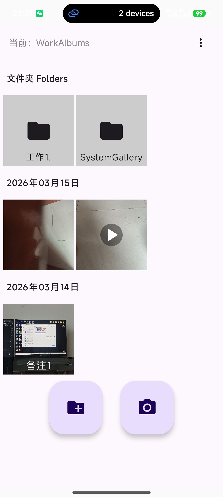
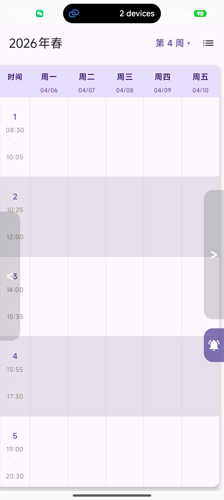
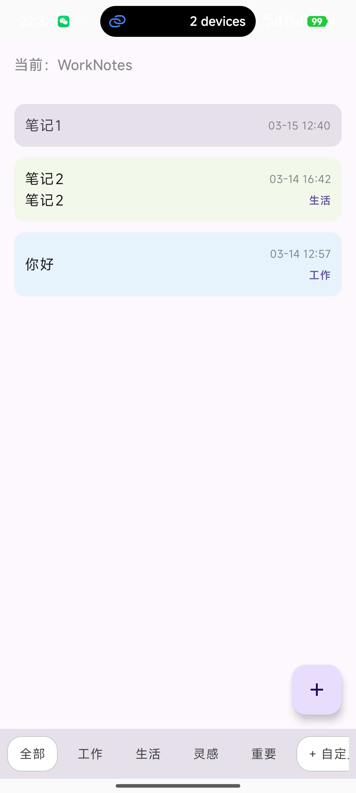
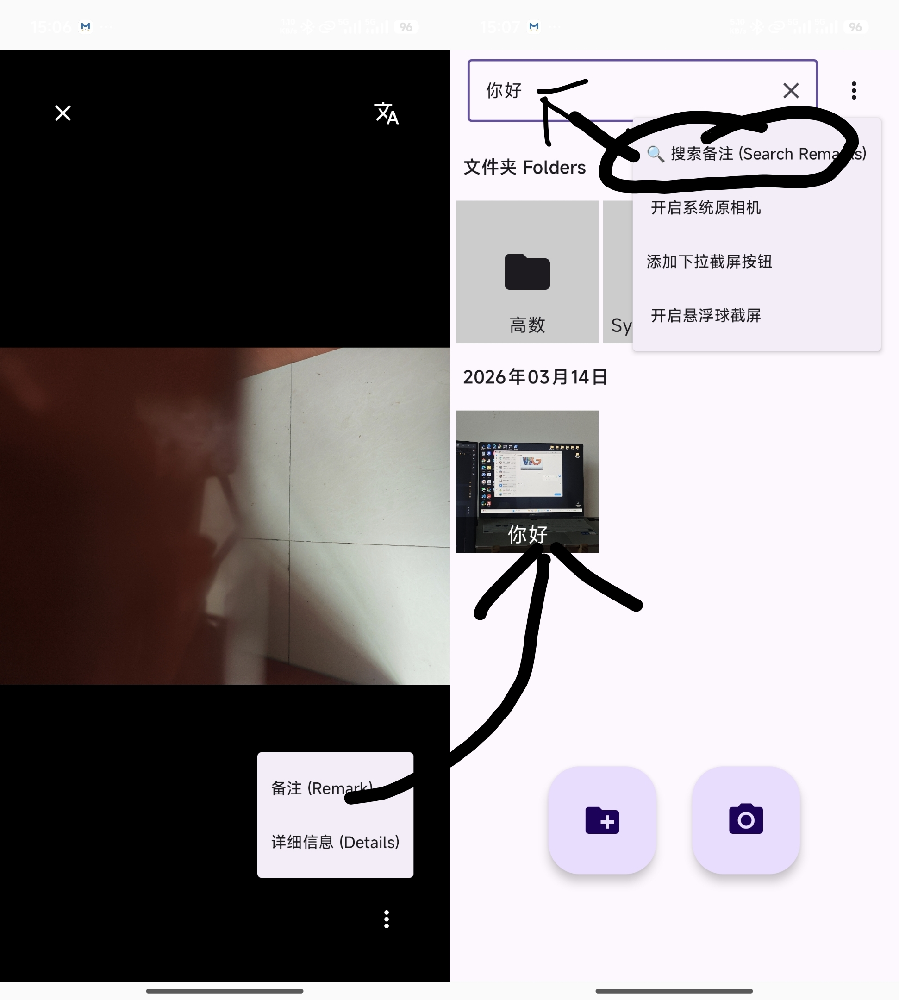
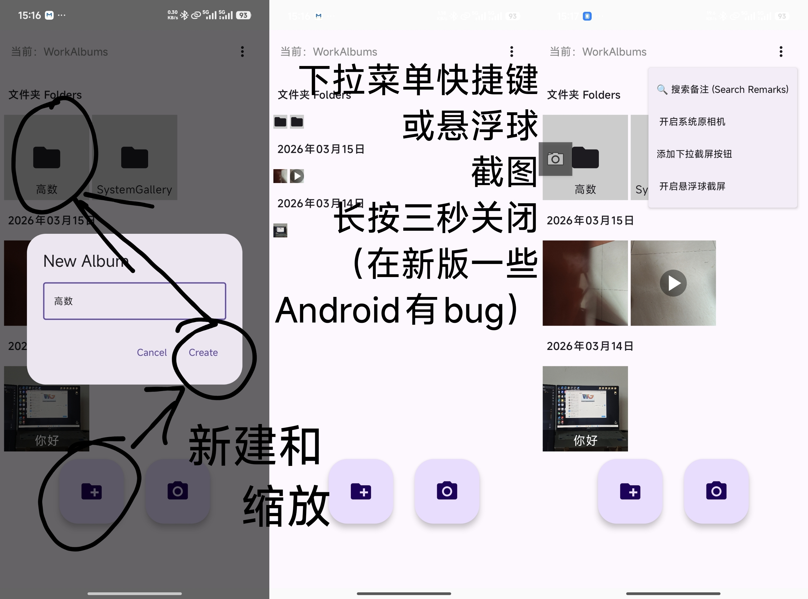
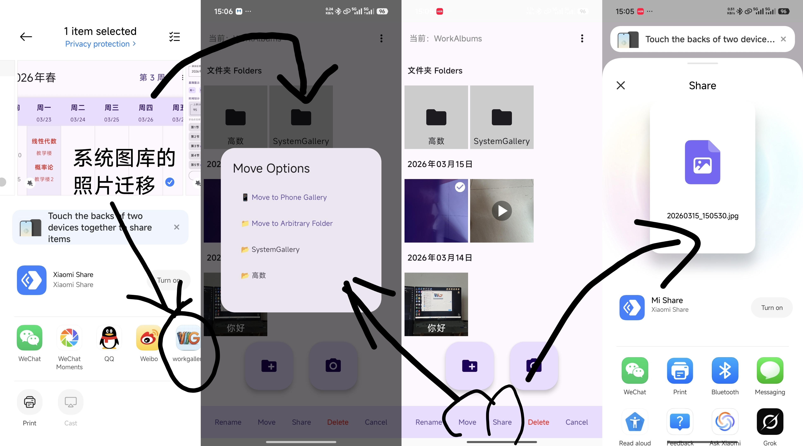
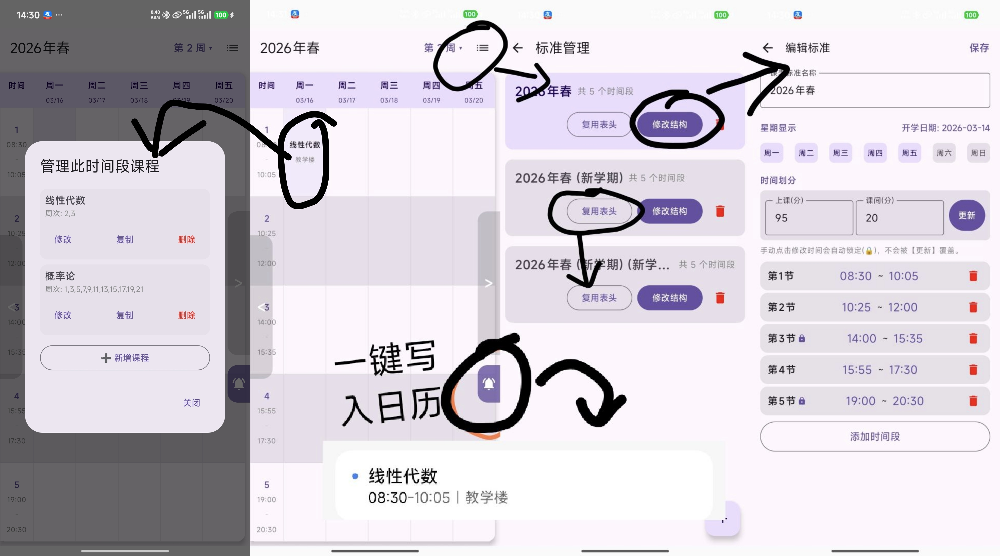
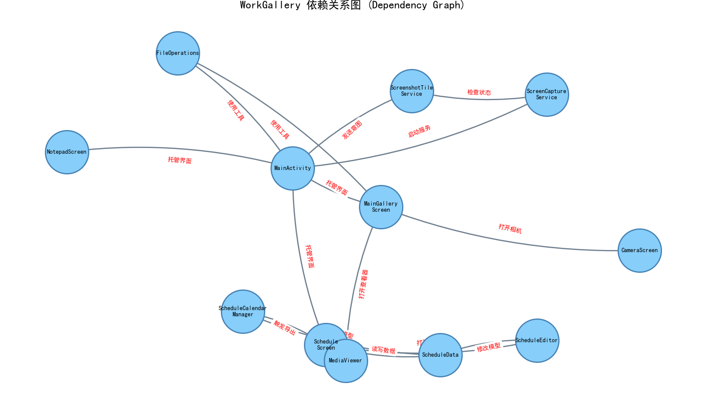

# WorkGallery
🎓 WorkGallery: Your Ultimate Academic Workspace
专为大学生打造的终极学业生产力工具

WorkGallery 是一款现代化的 Android 应用，旨在通过物理隔离的方式，将你的学习资料（上课拍照、课件、笔记）与个人生活彻底分开。
WorkGallery is a modern Android application designed to physically isolate your study materials (lectureshots, courseware, notes) from your personal life.
---

## 📱 核心界面概览 (Overview)
首先带你了解 WorkGallery 的三大核心入口。

| 1. 相册主页 (Gallery) | 2. 课表主页 (Schedule) | 3. 记事本 (Notepad) |
| :---: | :---: | :---: |
|  |  |  |

---

## 🌟 深度功能演示 (Detailed Features)

### 📸 1. 智能捕获与管理 (Smart Capture & Management)
* **全系统快速截屏**：通过悬浮球实现不中断网课的即时抓拍。
* **物理隔离存储**：文件保存在应用私有目录，不混入系统相册。
* **智能备注系统**：支持对每一张照片/视频进行文字备注，并支持全局搜索。

| 备注与搜索 (Search) | 文件、缩放与悬浮窗 (Zoom & Float) |
| :---: | :---: |
|  |  |

| 移动与分享 (Share) |
| :---: |
|  |

---

### 📅 2. 动态课程表 (Dynamic Course Schedule)
* **灵活排课**：支持自定义时间标准与课程格子快速复制。
* **日历同步**：一键将课程写入系统日历，享受系统级提醒。

| 日程功能深度展示 (Schedule Details) |
| :---: |
|  |

---

### 📝 3. 轻量化记事本 (Tag-based Notepad)
* **沉浸记录**：提供简洁的界面，专为作业要求和灵感笔记设计。

---

## 🛠 技术栈 (Tech Stack)
* **UI 框架**: Jetpack Compose (Modern Android UI)
* **媒体支持**: Media3 ExoPlayer & MediaProjection API
* **存储安全**: Scoped Storage & FileProvider

---

### 🛠 源码架构与依赖 (Architecture & Dependencies)

下图为几个主要文件源代码的依赖关系。为了方便初学者，作者将从零开发过程中编写的所有核心逻辑源码提取并打包。

> **提示**：本项目所有的核心逻辑代码文件均已同步存放于根目录下的 **[关键源文件.zip](./关键源文件.zip)** 中，欢迎下载学习。

---

## 📥 下载与安装 (Download)

你可以通过以下两种方式获取最新的安装包：

### 方式一：直接下载 (Recommended)
点击下方的绿色按钮，跳转至 GitHub Releases 页面下载最新的 APK 文件。

### 方式二：手动寻找
前往本仓库右侧的 [Releases](https://github.com/SpeedLebanc/WorkGallery/releases) 页面，下载 `app-debug.apk`。

> **安装注意**：
> 1. 下载后请允许“安装未知来源应用”。
> 2. 悬浮球截屏功能需要开启“在其他应用上层显示”权限。
